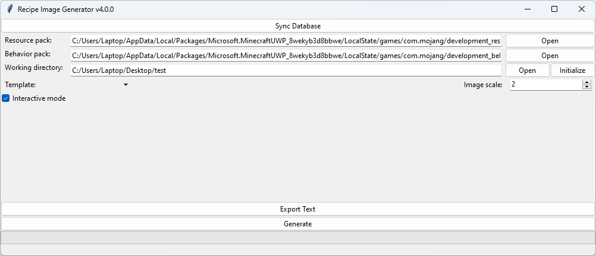
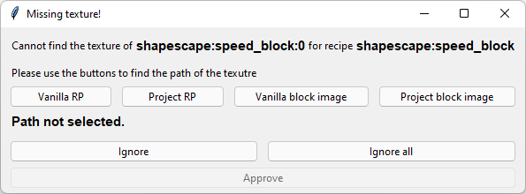

(usage)=
# Usage

## Running the Application

Assuming that Python and the Recipe Image Generator have been installed correctly, you can launch the tool from the command line by running the following command:

```
recipe-image-generator.exe
```

When you run the command `recipe-image-generator.exe`, it will download the repository you specified in the {ref}`SHAPESCAPE_RIG_DATABASE_URL environment variable<environment-variables>` into your user files. The user files are stored in *%localappdata%/shapescape/recipe-image-generator*.

Please note that the initial download of the data may take some time. Once the download is complete, the GUI will open, which should resemble the screenshot below:



## Setting up Your Project

To use the Recipe Image Generator, you need to provide it with some information about your project. Specifically, you'll need to specify the following three paths:

- The path to your Resource Pack.
- The path to your Behavior Pack.
- The path to your Working Directory.

The Resource Pack and Behavior Pack paths are straightforward. These packs will be used by the tool to detect recipes and find textures for custom items and blocks that aren't included in the default pack provided by the Recipe Image Generator Data repository.

```{note}
If you use the application to generate images that don't have recipes on them, you can set the Resource Pack and Behavior Pack to any random path. They won't be used anyway.
```

The Working Directory is the location where the Recipe Image Generator stores configuration information and exports images. You can find more information about the structure of the Working Directory in the {ref}`Project Structure<project-structure>` article. For now, it's enough to know that any files generated by the Recipe Image Generator will be stored in the `generated-images` folder located within the working directory.

## Initializing the Project
When you open the project for the first time, you can use the "Initialize" button to copy files from `example-workspace` of the {ref}`Data Repository<data-repository-structure>` to your project folder and prepare some other files for your project (see {ref}`Project Structure<project-structure>` for more details).

## Generating Files

After you have specified the paths required by the Recipe Image Generator, you can begin generating images by selecting a template from the drop-down menu and clicking the "Generate" button. The generator will then begin processing your recipes and generating images accordingly.

```{warning}
Before you start generating anything you need to define some templates for your project. You can read more about the structure of the templates in the {ref}`Templates<templates>` article. Shapescape hosts an example data repository which has some template examples [here](https://github.com/ShapescapeMC/Shapescape-Recipe-Image-Generator-Data).
```

You can setup various configurations related to the generation process. To learn about them read the {ref}`GUI<gui>` article.

(interactive-mode-missing-texture-window)=
## The Interactive Mode "Missing Texture!" Window

If you launch the Recipe Image Generator with the "Interactive mode" checkbox selected, you may occasionally be prompted to provide the path to a texture for a particular item or block. The window will look similar to this:



As you can see, the window is comprised of three rows of buttons:

- The top row of buttons provides options for locating the file in various directories:
  - **Vanilla RP** opens the vanilla resource pack.
  - **Project RP** opens the resource pack of the current project.
  - **Vanilla block images** opens the path containing renders of the vanilla blocks.
  - **Project block images** opens the path containing renders of the blocks specific to your project. Note that this path may be empty, as you may need to render the blocks yourself before using them.

- The middle row of buttons offers options for skipping texture selection:
  - **Ignore** ignores the current texture only.
  - **Ignore all** ignores the current texture and disables interactive mode for until the end of the generation process.

- The bottom row features a single **Approve** button for confirming your selection once you've made your choice. Note that this button remains disabled until you've selected a path from the first row of buttons.

```{warning}
Running in non-interactive mode, or pressing "Ignore" or "Ignore all" simply means that the some images will be generated without the unknown textures. This can be useful for testing purposes, but in a final product you should never use that option.
```

### Vanilla Files vs. Project Files

When selecting a texture path, it's important to note the difference between vanilla files and project files. If you choose a texture from the vanilla files, the Recipe Image Generator will save the mapping to the global `data_map.json` file, which is uploaded to the {ref}`data repository<data-repository>`. This allows other users to benefit from the mapping and eliminates the need for them to provide the texture path for the same item or block in the future.

If you choose a texture from the project files, the mapping will be saved in the local `data_map.json` file. This means that the next time you run the app in this project, it will use the same texture path for the same item or block. Utilizing the "Project block images" and "Project RP" buttons can be especially useful when mapping custom items or blocks that are specific to your project.
